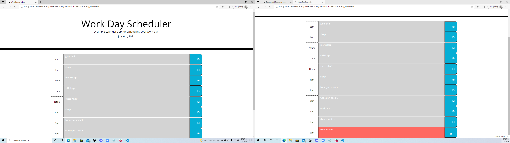

# Work Day Scheduler

## Description

-The motivation behind this project was to create a day planner for the general work day, the times chosen to be included ranged from 8am to 6pm.
-This project was unique, in the sense that many of the things we learned and are going to use in this project, we went through quickly in class, so this was very much so a lesson in trial and error.
-Surprisingly, even with the struggles I anticipated to encounter, this project was quite enjoyable and expanded my understandings of local storage, and the differences between javascript and jquery.

## User Story

AS AN employee with a busy schedule
I WANT to add important events to a daily planner
SO THAT I can manage my time effectively

## Acceptance Criteria

GIVEN I am using a daily planner to create a schedule
WHEN I open the planner
THEN the current day is displayed at the top of the calendar
WHEN I scroll down
THEN I am presented with timeblocks for standard business hours
WHEN I view the timeblocks for that day
THEN each timeblock is color coded to indicate whether it is in the past, present, or future
WHEN I click into a timeblock
THEN I can enter an event
WHEN I click the save button for that timeblock
THEN the text for that event is saved in local storage
WHEN I refresh the page
THEN the saved events persist

The following picture shows the functionality.  *Please note this was taken during the last time block hour, so future color isnt shown* 

https://kingcrowz.github.io/Zaleski-05-homework/

## Grading Requirements
- HTML
- CSS
- JAVASCRIPT
- BOOTSTRAP
- GOOGLEAPIS
- FONTAWESOME
- MOMENT
- JQUERY

## CONTACT ME

- 6098287324
- kingcrowz@comcast.net
